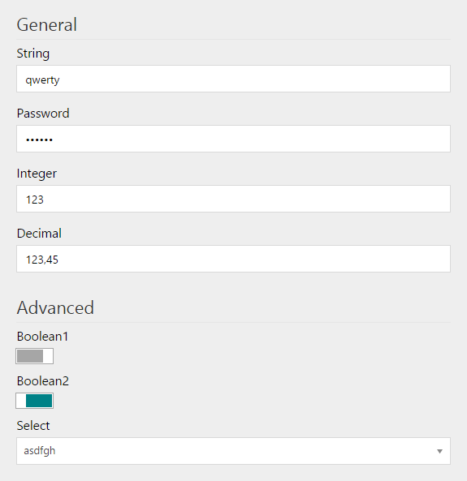

---
title: Managing Module Settings
description: The developer guide to managing Virto Commerce settings
layout: docs
date: 2015-10-22T13:54:19.273Z
priority: 3
---
## Overview

VirtoCommerce WebAdmin provides the following infrastructure for settings:
* Standard UI accessible through Browse > Settings > Module
* Web API
* ISettingsManager interface for managed modules
* Database storage

## Standard UI

Standard UI allows to view and edit simple settings.



Each module can add settings to a standard UI by declaring them in the module manifest.

```
<module>
  ...
  <settings>
    <group name="General">
      <setting>
        <name>MyModule.General.Priority</name>
        <valueType>string</valueType>
        <allowedValues>
          <value>High</value>
          <value>Normal</value>
          <value>Low</value>
        </allowedValues>
        <defaultValue>Normal</defaultValue>
        <title>Priority</title>
        <description>Select one of the allowed values</description>
      </setting>
    </group>
  </settings>
</module>
```

|Element|Description|
|-------|-----------|
|**settings**|The root element for all settings. Can contain multiple **group** elements.|
|**group name="..."**|Defines a named group of settings. Can contain multiple **setting** elements.|
|**setting**|Defines a setting|
|**name**|The system name of the setting. It is recommended to give names like this: **ModuleId.SettingsCategoryName.SettingName**. For Example, **VirtoCommerce.Core.Security.LockoutDuration**, where **VirtoCommerce.Core** is the module ID, **Security** is the settings category name and **LockoutDuration** is the setting name.|
|**valueType**|The type of the value. Supported types are: **string** - for short text (up to 512 characters); **secureString** - for short text masked with asterisks or circles in UI; **text** - for long text (longer than 512 characters); **integer**; **decimal**; **boolean**|
|**allowedValues**|[Optional] Defines a list of allowed values. Can contain multiple **value** elements. User can select one of the values in standard UI.|
|**defaultValue**|Defines the default value which will be returned by **GetValue()** method if the value has not been stored in database yet.|
|**title**|The user friendly name of the setting which is shown in standard UI.|
|**description**|The description of the setting which is shown in standard UI as tooltip.|

## Web API

GET api/platform/settings/values/MyStringSetting

POST api/platform/settings  

```
[ { Name: "MyStringSetting", Value: "abc", ValueType: "string" }, { Name: "MyIntegerSetting", Value: "123", ValueType: "integer" } ]
```

## ISettingsManager

Managed code can use the following methods of ISettingsManager:
```
T GetValue<T>(string name, T defaultValue)
```
```
void SetValue<T>(string name, T value)
```

GetValue will return the first available value in the following order:

value stored in databasedefault value declared in module manifestdefault value passed as the parameter
```
using Microsoft.Practices.ServiceLocation;
using VirtoCommerce.Platform.Core.Settings;
 
var settingsManager = ServiceLocator.Current.GetInstance<ISettingsManager>();
 
var integerValue = settingsManager.GetValue("MyIntegerSetting", 0);
var decimalValue = settingsManager.GetValue("MyDecimalSetting", 0m);
var booleanValue = settingsManager.GetValue("MyBooleanSetting", false);
var stringValue = settingsManager.GetValue("MyStringSetting", string.Empty);
 
settingsManager.SetValue("MyDecimalSetting", 1.23m);
```
